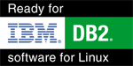

## Statement

The charts/tables included in this presentation are not based on real figures.

It is just to demonstrate the features of slidify


<div style='text-align: center;'>
    
</div>

--- bg:ibm-db2.png

## Enable connectivity  for your instance

1. Update dbm cfg using svcename 50001   (or any port you want DB2 to listen on)
2. db2set comm=tcpip     (to enable the listener for tcpip)
3. db2stop - db2start to read these settings and create the listener

--- .class #id 

## Number of customers using DB2 in Belgium

```{r, results="asis", echo=FALSE}
library(xtable)
print(xtable(db2[1:5, 1:2]), type="html", html.table.attributes='class:mytable')
```

---

Simple chart showing the number of customers in Belgium

```{r, echo=FALSE}

year<-c("2000","2001","2002","2003","2004")
cust<-c(100,200,300,400,500)
db2<-cbind(year,cust)
plot(year~cust,type="l",main="DB2 customers in BE")
```

--- &radio
## Question 1

What is SVCENAME ?

1. database configuration setting services
2. _database manager setting the port for this instance or symbolic name translated in etc/services_

*** .hint
There is only port used by the instance

*** .explanation
SVCENAME is a dbm config setting specifyng the port number the instance is listening on


