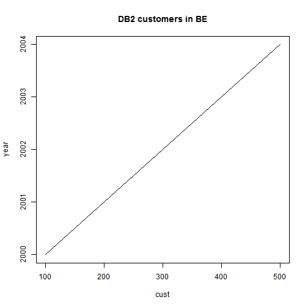

 

--- &radio
## Question 1

What is SVCENAME ?

1. database configuration setting services
2. _database manager setting the port for this instance or symbolic name translated in etc/services_

*** .hint
There is only port used by the instance

*** .explanation
SVCENAME is a dbm config setting specifyng the port number the instance is listening on

